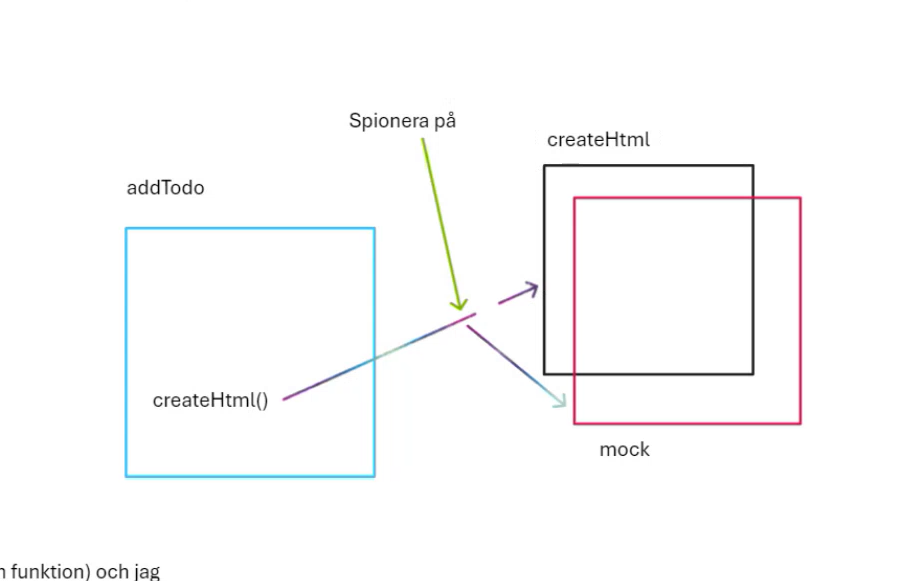
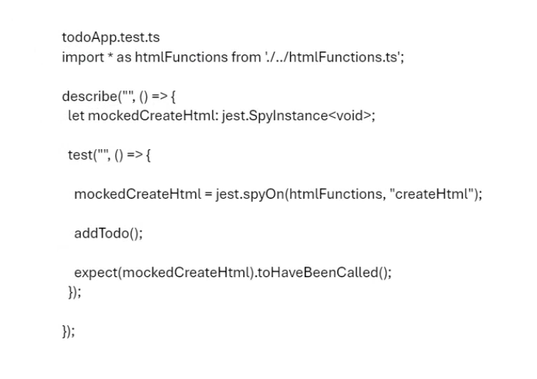

# Enhetstester övningar

## För att köra detta projekt skriv:
npm run dev

## Installationer på detta projekt:

### VITE -
npm create vite
vanilla
typescript
skriv ett namn
gå in i den nya mappen du skrev namnet på, om du inte står där automatiskt

npm i

npm run dev

### Jest - 

npm i -D jest @types/jest ts-jest

Om du skriver detta kör jest testerna först, sen kommer det upp en meny i slutet:
npx jest --watchAll

### Code Coverage (lektion 2, 16 maj 2024)

npx jest --coverage

skriv in i package,json under "jest"
"collectCoverage": true,
"coverageReporters": ["html"]

Det bildades en coverage-mapp land dina filer. Det finns en index.html i den. Där finns samma tabell som dök upp i terminalen när du skrev npx jest --coverage förut.

Lägg in coverage-mappen i gitignore-filen. Skriv i gitignore: coverage

### Fiktiv webbläsare till Code coverage

För att du ska kunna testa ordentligt, behöver du en fiktiv webbläsare. Installera den såhär:

npm i -D jest-environment-jsdom

För att konfigurera det, så att den kan köras, gå till package.json och skriv i Jest-konfigurationen:
"testEnvironment": "jsdom"

### Spioner

htmlFunctions.ts skapas för att vi behöver den till spioner
Vi flyttar hela createHrml-functionen från todoApp.ts till htmlFunctions.ts.
Men man måste exportera den och importera den i todoApp.js, så att den går att anropa, och använda.